## Getting Started

There are several tools that make writing, previewing, and testing RAML easier.  In this section we will introduce the API Workbench that you can use throughout the tutorial. There are also others. For example, check out [MuleSoft's API Designer](#https://github.com/mulesoft/api-designer).

If you have an development environment already, please jump ahead to the [RAML Basics](#raml-basics) section.

### API Workbench

In November 2015, MuleSoft released the API Workbench as an open-source tool that give developers a rich, full-featured integrated development environment (IDE) for designing, building, testing, documenting and sharing RESTful HTTP APIs. The core of the API Workbench is Github’s Atom, a text editor that is designed to be deeply customizable and extensible to build a unique experience for every developer. The API Workbench, different from the API Designer, is an IDE that can be used locally which comes with a lot advantages such as an easier integration of version control and collaboration tools.

#### Installing the API Workbench

To get started with the API Workbench, you'll need to get [Github’s Atom](https://atom.io/docs/v0.194.0/getting-started-installing-atom) on your system first. After you've done the installation, installing the API Workbench should be fairly simple. The easiest way is to use Atom's package manager that is installed by default. Go to `Preferences` in Atom's main menu (on Mac that is called Atom).

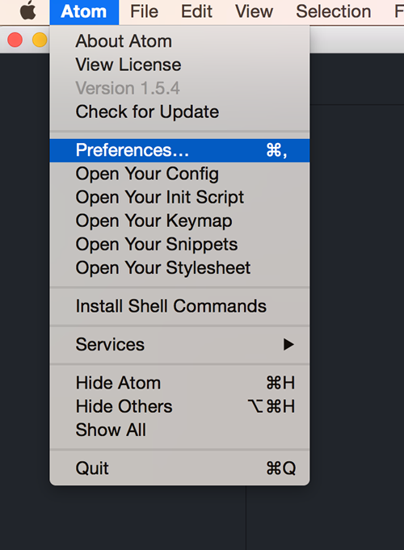

That opens an additional `Settings` tab with an option to `Install` new plugins. Choose that option and simple type in `api-workbench` to search for the plugin.

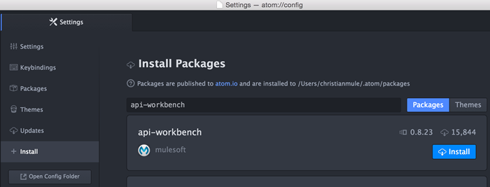

Now click on the `Install` button in your search result and wait until the installation process is done. This process is happening in the background and you will not get notified when finished. So just wait until you will find the `api-workbench` plugin under the list of installed packages.

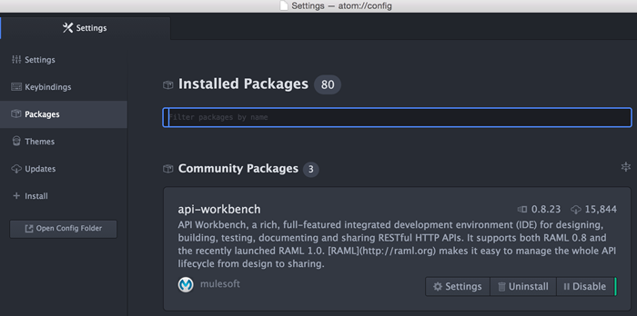

#### Creating your first RAML

After installing the API Workbench you should also have an additional menu entry in the `Packages` menu called `API Workbench`. It contains different features that will support developers with not only creating a RAML project from scratch, but also to obtain popular community APIs from an external Github repository; and more.

To create a project from scratch, simple click on `Create RAML Project` and fill in all necessary information before confirming using the `Create` button.

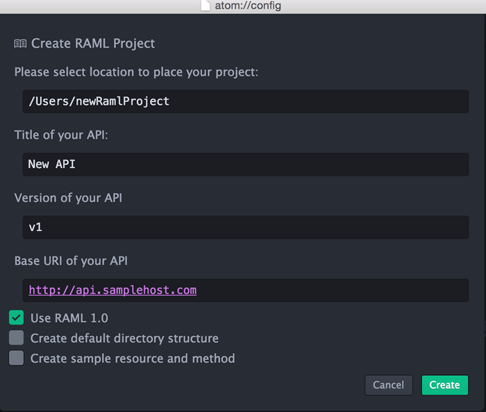

Depending on the information you put in, and let us assume the information are the same as in the image above, you should get a single **api.raml** file with the following content:

```yaml
#%RAML 1.0
title: New API
version: v1
baseUri: http://api.samplehost.com
```

### RAML Basics

The nice thing about using a tool like the API Designer is that it will automatically prefill the required aspects of your RAML file for you.  These are the:

- RAML and version declaration
- Your API Title
- The BaseUri for your API
- The version of your API (ie version 1, 2, 4, etc)

To start the file off, we'll simply add `#%RAML` followed by the version of RAML that we are using, in this case 1.0:

```yaml
#%RAML 1.0
```

This tells the parser that this should be handled as a RAML file, and also what version of RAML so that the parser knows how to handle the different types of functionality (for example, many features available in RAML 1.0 are not available in RAML 0.8 - this tells the parser to take advantage of these features).

Once we have declared the file as a RAML file (as shown above) the next thing we need to do is give our API a title, such as `My API`:

```yaml
#%RAML 1.0
title: My API
```

So far this has been pretty easy, right?  The next thing to add is our `baseUri`, or what the root domain and path for the API is.  This will be used by the majority of the tooling to tell your users where to make the calls, and even help them test their calls.  To add the `baseUri`, simply add it in like so:

```yaml
#%RAML 1.0
title: My API
baseUri: http://api.mydomain.com
```

Last but not least, we should declare what version of the API "My API" this is.  This will be used to help ensure developers know which version of the API they're using, as well as for all of your documentation.  This will also help you segment versions of your API for when you inevitably have to create a new version.

We do this by adding in the `version` property like so:

```yaml
#%RAML 1.0
title: My API
baseUri: http://api.mydomain.com
version: 1
```

And there you go!  Just like that you have started off your RAML file.  The next part is adding in resources, methods, and properties - which the next few sections will walk you through.  The nice thing is, each aspect of RAML is as easy, and as clear-cut as the four items we declared above.

### Creating Resources

Creating resources in RAML is as easy as writing down it's path.  For example, if we wanted to create an API with a `/users` resource, all we would need to type is `/users:` like so:

```yaml
#%RAML 1.0
title: My API
baseUri: http://api.mydomain.com
version: 1

/users:
```

Just like that we now have a `/users` resource:

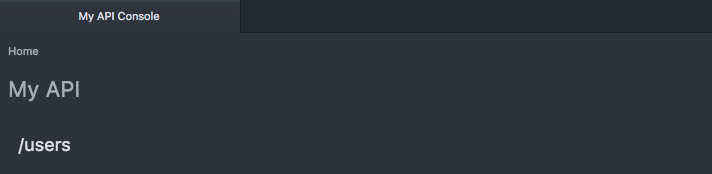

To add a description to our `/users` resource, we simply follow YAML conventions and add the `description` property:

```yaml
#%RAML 1.0
title: My API
baseUri: http://api.mydomain.com
version: 1

/users:
  description: this is my users resource!  isn't this easy?!
```

And once again, just like that, the description is added to our resource:

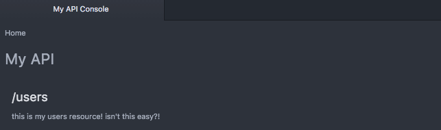

#### URI Properties

To create more complex resources, or resources that utilize names or IDs, you can take advantage of URI properties, or placeholders within the resource.  To do this, simply tell the spec that your ID is a URI Property by placing curly brackets around it, like so:

```yaml
/users/{id}:
```

Just like that you can setup IDs or dynamic resource paths:

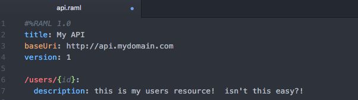

#### Nested Resources

But another great feature of RAML is something called resource nesting, or creating child resources.  To add a nested resource, simply follow YAML convention by tabbing in once under the parent resource, and then declare your child resource as you did your parent resource - but with a relative path from the parent's path:

```yaml
#%RAML 1.0
title: My API
baseUri: http://api.mydomain.com
version: 1

/users:
  description: this is my users resource!  isn't this easy?!

  /{id}:
    description: this is a nested dynamic resource using a URI property
```

As you can see, the `/{id}` resource is now a child of the parent resource.  This lets you define your API in a way that is efficiently organized, letting you quickly find all sub-resources under their parent.

However, it's important to note that the child resources inherit the parent path ONLY - and do not inherit any of parent's properties such as it's resourceType or methods, unless specifically specified in the child resource (as you did in the parent).

For example, if we look at this RAML snippet:

```yaml
#%RAML 1.0
title: My API
baseUri: http://api.mydomain.com
version: 1

/users:
  get:

  /{id}:
```

You'll notice that the resource `/users` has a `GET` method, however the child resource `/{id}` does not.  

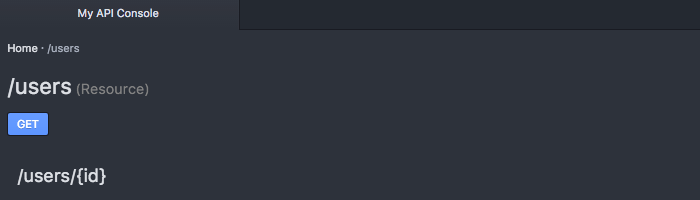

Again, this is because the child resource only inherits the path and not the properties of its parent.

### Creating Methods

Just as creating resources was as simple as declaring the path, adding methods is as simple as declaring the method:

```yaml
#%RAML 1.0
title: My API
baseUri: http://api.mydomain.com
version: 1

/users:
  get:
```

Which in turn creates:

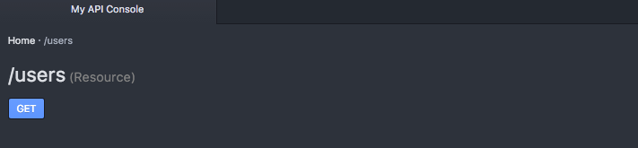

RAML supports `GET`, `PUT`, `PATCH`, `POST`, `DELETE`, `HEAD`, and `OPTIONS` although you'll want to be careful which ones you use as not all are official methods, and not all are supported by all servers.

It's also important to understand the difference between each of these methods as they all have VERY specific purposes with careful and well established standards surrounding them.

Like with resources, you can add a description to your methods.  This is a perfect place to share what the method is and what it does, and can be used in generating documentation for your API.  

To add a description, simply use the `description` property:

```yaml
#%RAML 1.0
title: My API
baseUri: http://api.mydomain.com
version: 1

/users:
  get:
    description: this is my get method
```

#### Querystring Parameters

Another common functionality with APIs is Querystring Parameters, or manipulating the response using the URI querystring.

RAML lets you document the different querystrings under the method they are being implemented under (hopefully this is the `GET` method!!!) by using the `queryParameters` property, like so:

```yaml
#%RAML 1.0
title: My API
baseUri: http://api.mydomain.com
version: 1

/users:
  get:
    description: this is my get method
    queryParameters:
```

For each `queryParameter` you will simply need to declare the name of the parameter, keeping it consistent with how it is used within the URL.  So if our URL was `http://api.mydomain.com/users?status=active` we would call the query parameter "status" like so:

```yaml
#%RAML 1.0
title: My API
baseUri: http://api.mydomain.com
version: 1

/users:
  get:
    description: this is my get method
    queryParameters:
      status:
```

And as simple as that, we now have the `status` query parameter showing up in our API documentation:

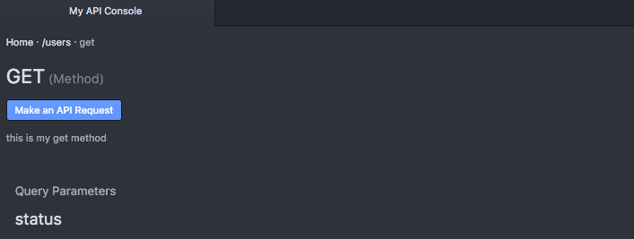

Of course, there is much more you can do with the query parameter, such as providing it's display name, a description, an example, the default value, whether or not it is required, and even it's type:

```yaml
#%RAML 1.0
title: My API
baseUri: http://api.mydomain.com
version: 1

/users:
  get:
    description: this is my get method
    queryParameters:
      status:
        displayName: Status
        description: Status of the users to retrieve (active, inactive, all)
        default: all
        required: false
        type: string
```

By providing this additional information, you are empowering your users as this information can be passed through to them in your documentation, as well as taken advantage of by other tools that parse your API's RAML spec.

#### Body Data

RAML also lets you share examples of what the user should be sending when making `PUT`, `PATCH`, or `POST` calls by using the `body` property, and then the corresponding content-type:

```yaml
#%RAML 1.0
title: My API
baseUri: http://api.mydomain.com
version: 1

/users:
  post:
    body:
      application/json:
```

Unfortunately, this really doesn't change the way our documentation works as we still have not provided WHAT the body should look like.

To do this we have two options, we can share a schema (more often used with XML) or provide an example of the data being shared.

Of course, if we'd like we can share both by using the corresponding properties:

```yaml
#%RAML 1.0
title: My API
baseUri: http://api.mydomain.com
version: 1

/users:
  post:
    body:
      application/json:
        type: |
          {
            "$schema": "http://json-schema.org/draft-04/schema#",
            "id": "http://jsonschema.net",
            "type": "object",
            "properties": {
              "name": {
                "id": "http://jsonschema.net/name",
                "type": "string"
              },
              "city": {
                "id": "http://jsonschema.net/city",
                "type": "string"
              },
              "state": {
                "id": "http://jsonschema.net/state",
                "type": "string"
              }
            },
            "required": [
              "name",
              "city",
              "state"
            ]
          }
        example: |
          {
            "name": "Mike Stowe",
            "city": "San Francisco",
            "state": "CA"
          }
```

By providing both this lets us share with our users what the request should look like, as well as the specific information about what the request needs to include and how it should be formatted, something that again can be provided to them via your documentation and also used to generate auto-validating SDKs:

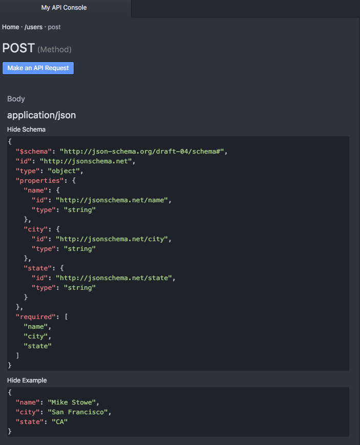

Of course, your API may support numerous content-types, which works fairly well with RAML, as all you have to do to add an additional content type is, well, add it (I'm removing schemas in this case to keep it short, but of course RAML supports multiple content-types having schemas):

```yaml
#%RAML 1.0
title: My API
baseUri: http://api.mydomain.com
version: 1

/users:
  post:
    body:
      application/json:
        example: |
          {
            "name": "Mike Stowe",
            "city": "San Francisco",
            "state": "CA"
          }
      text/xml:
        example: |
          <user>
            <name>Mike Stowe</name>
            <city>San Francisco</city>
            <state>CA</state>
          </user>
```

As you can see, we now have multiple content types to choose from shown in our documentation:

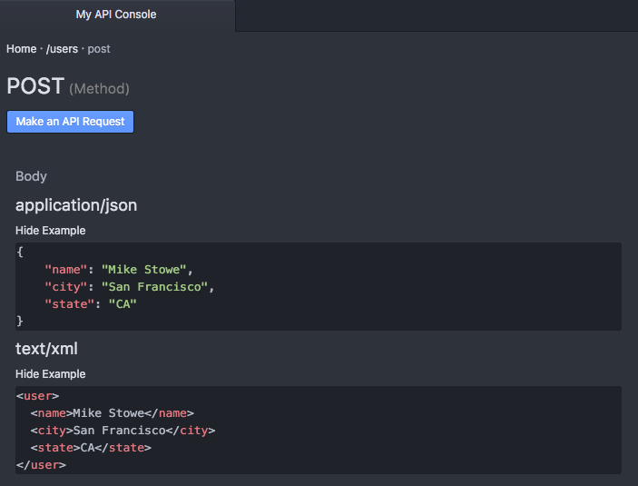

What's important to remember is that schemas describe the request content, where-as examples are "real-life demos" of what that formatted content would look like when being sent to your server via the content-type body.

### Handling Responses

RAML lets you easily describe all aspects of your API resource method's responses for multiple status codes including defining headers, content-types, schemas, and example responses.

To declare responses in RAML, simply use the `responses` property:

```yaml
#%RAML 1.0
title: My API
baseUri: http://api.mydomain.com
version: 1

/users:
  post:
    responses:
```

#### Status Codes

As RAML is intended to describe HTTP REST APIs, responses rely on the standard HTTP status codes.

The most popular status codes are:

Status Code | Description | Generally Returned For
----------- | ----------- | ------------
**2xx** | **Successful** |
200 | The request was handled successfully | GET, PUT, PATCH
201 | A new object has been created | POST
204 | The request was successful, but there's no content to return | DELETE
**3xx** | **Redirection** |
301 | Resource or item moved permanently | ALL
304 | Nothing was modified by the request | PUT, PATCH
**4xx** | **Client Error** |
400 | The request could not be understood by the server | ALL
401 | Not authorized to access or perform action | ALL
404 | The resource or item could not be found | GET
405 | The method attempted (GET, PUT, POST, etc) is not allowed | ALL
415 | The media type request (JSON, XML, etc) is not supported | ALL
**5xx** | **Server Error** |
500 | The server experienced an unexpected error and could not complete the request | ALL

The above table only represents a fraction and there are more.

To setup responses for each status, use the status code as the key for the response, like so:

```yaml
#%RAML 1.0
title: My API
baseUri: http://api.mydomain.com
version: 1

/users:
  post:
    responses:
      201:
        # 200 - Object Created
      400:
        # 400 - Bad Request
      500:
        # 500 - Server Error
```

Which as you can see adds them to our API documentation for that method:

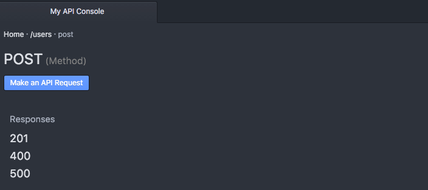

#### Headers

Headers are used to transmit important information about the response, such as the location of newly created object.

Adding headers is as simple as using the `headers` property within the status code's response block.  Then add the name of the header (such as `location`) as the property.

```yaml
#%RAML 1.0
title: My API
baseUri: http://api.mydomain.com
version: 1

/users:
  post:
    responses:
      201:
        headers:
          location:
            #location data will go here
      401:
        # Not Authorized
```

Once you have defined the header by the property name you can add the following properties to each header property as necessary:

Property | Description
-------- | -----------
displayName | How to display the header in documenation
type | Data type of the header property such as string, integer, etc
example | An example of the type of data the header may return

For example:

```yaml
#%RAML 1.0
title: My API
baseUri: http://api.mydomain.com
version: 1

/users:
  post:
    responses:
      201:
        headers:
          location:
            displayName: Location
            type: string
            example: http://http://api.mydomain.com/users/109
      401:
        # Not Authorized
```

As you can see, this is then translated into our documentation for us:

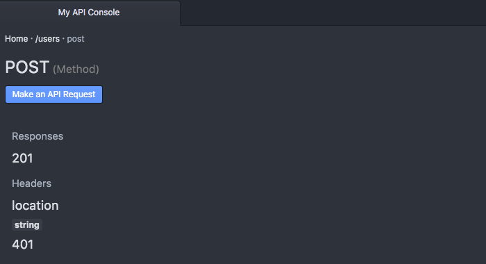

#### Content Types

RAML also lets you define not just one, but multiple content types for each HTTP Status Response code.

This means that you can return back data as JSON, XML, plain text, form-encoded, or other formats.

To define a content type, first state that you are returning back body data by using the `body` property, and then use the associated content-type for that content type, like so:

```yaml
#%RAML 1.0
title: My API
baseUri: http://api.mydomain.com
version: 1

/users:
  post:
    responses:
      201:
        headers:
          # header information
        body:
          application/json:
```

To list multiple content types, you can simply add additional content types within the `body` section of the status code response data, like so:

```yaml
#%RAML 1.0
title: My API
baseUri: http://api.mydomain.com
version: 1

/users:
  post:
    responses:
      201:
        headers:
          # header information
        body:
          application/json:
          text/xml:
```

The next step to showing off these content types is adding in example response data so that we can see what they look like.

#### Examples

A unique feature of RAML compared to some other specifications is the ability to create your own examples rather than forcing you to build a schema for the response.

Adding an example is as simple as using the `example` property.  However, because most examples are multi-lined, and because RAML is written in the YAML format, you'll need to add a pipe "|" so that it can be properly parsed.  

Another option, of course, is to include your example using `!include` which we will talk about in a later chapter.

```yaml
#%RAML 1.0
title: My API
baseUri: http://api.mydomain.com
version: 1

/users:
  post:
    responses:
      201:
        headers:
          # header information
        body:
          application/json:
            example: |
              {
                "response" : "data"
              }
          text/xml:
            example: |
              <response>
                data
              </response>
```

Now if we look at the API Console we can see multiple content types (one for JSON and one for XML) as well as the example response data for each:

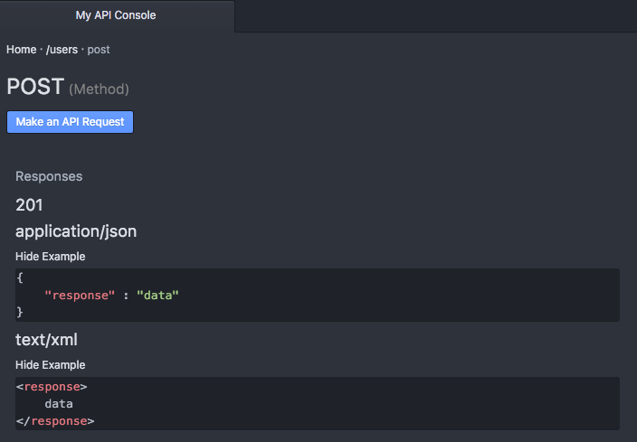

You can also define multiple examples using `examples` property instead of `example`. For each example, you need to provide a unique key.

```yaml
#%RAML 1.0
title: My API
baseUri: http://api.mydomain.com
version: 1

/users:
  post:
    responses:
      201:
        headers:
          # header information
        body:
          application/json:
            examples:
              example1: |
                {
                  "response" : "data"
                }
              example2: |
                {
                  "response" : "another data"
                }              
```

## Setting up Templates

Now that you have an idea of what your API resources will look like, RAML let's you setup includes and templates to allow for both code reuse and the implementation of design patterns.  This not only ensures that your API is consistent throughout, but also lets you organize your API to keep it easily readable by those working with the RAML spec.

It's important to remember that the benefits of code reuse and design patterns are both immediate and long-term.  While you may feel that you can build a consistent API, the patterns ensure consistency.  This especially becomes important as your API grows and newer developers start working with it - often times trying to implement new resources or methods without having a strong and full understanding of your entire API.

### Includes

The easiest of the templates to setup, the `!include` function lets you pull in external files, whether they be another RAML file, example response files, or schemas.

Using the !include file is as simple as:

```yaml
#%RAML 1.0
title: My API
baseUri: http://api.mydomain.com
version: 1

/resource:
  get:
    responses:
      200:
        body:
          application/json:
            example: !include examples/resource_get.json
            type: !include types/resource_get.json
```

### ResourceTypes

ResourceTypes on the other hand let you create resource templates, or specific templates based on the type of resource, often split into item or collection.

For example, if you are performing an operation on a collection (usually the resource WITHOUT an ID) you can setup a resourceType so that all your collection based resources operate exactly the same (just with different data).

You can also do the same with your item resources (/resource/{ID}), again creating a specific template that ensures that all item resources look and feel the same way.

Another huge advantage of resourceTypes is that it lets you define all your possible responses in a single place, rather than having to repeat your general status code responses (200, 201, 301, 304, 401, 404, 405, 415, 500) for each of the individual resources.

```yaml
#%RAML 1.0
title: My API
baseUri: http://api.mydomain.com
version: 1

resourceTypes:
  collection:
    get:
      description: this is a get method
    post:
      description: this is a post method
    delete:
      description: this is a delete method
      responses:	 		
        202:
          headers:
        304:
          body:
            application/json:
              example: |
                { "Response" : "Nothing Modified" }
        401:
          body:
            application/json:
              example: |
                { "Response" : "Not Authorized" }
        405:
          body:
            application/json:
              example: |
                { "Response" : "Method Not Allowed" }
        415:
          body:
            application/json:
              example: |
                { "Response" : "Content-type Not Recognized" }
        500:
          body:
            application/json:
              example: |
                { "Response" : "Internal Server Error" }
/users:
  type: collection
```

You'll noticed that the `/users` doesn't actually have any properties assigned to it other than `type: collection`, but because it is of a known resourceType, all of the information will be automatically pulled into it for us:

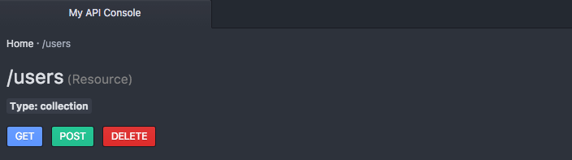

Including method properties:

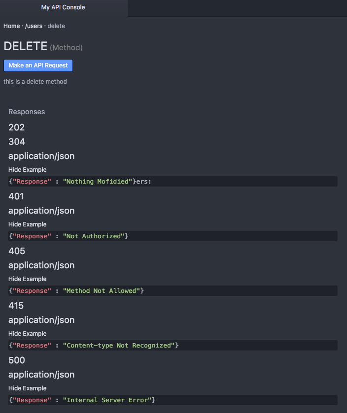

#### Declaring Optional Methods

Of course, chances are you do not want ALL the information to be pulled in all of the time, in which case you can make methods OPTIONAL by adding a `?` to the end of the method name, like so:

	#%RAML 1.0
	title: My API
	baseUri: http://api.mydomain.com
	version: 1

	resourceTypes:
	 - collection:
	 	get?:
	 		description: this is a get method

	 	put?:
	 		description: this is a put method

	 	post?:
	 		description: this is a post method

	 	delete?:
	 		description: this is a delete method

	/users:
		type: collection

Now the `/resource` does not have ANY properties being pulled in because we have declared all the methods to be optional, and to only be pulled in if explicitly called by the resource.

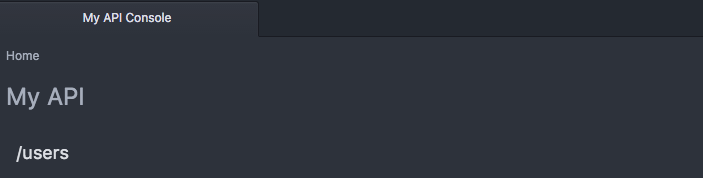

But the second we call in one of the properties, we now have it's description and any underlying properties that we would delcared:

	/users:
		type: collection
		get:

As you can see here:

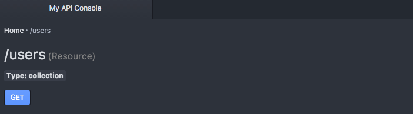

####Placeholders within ResourceTypes
Just as you probably do not want all methods in every resource, chances are you probably want different descriptions, examples, properties, and other data within your resources.

Keep in mind, that you can always override the resourceType by typing in the data again, or by not having the data wtihin your resource to begin with.

However, for properties that are consistent across your resources, it may be most efficient to take advantage of placeholders, or variables within the template that will be replaced by the placeholder value assigned by that resource once pulled in.

Placeholders within RAML are denoted by double less than and greater than signs, or `<<PLACEHOLDER>>`.

```yaml
#%RAML 1.0
title: My API
baseUri: http://api.mydomain.com
version: 1

resourceTypes:
  collection:
    get:
      description: this is a get method
      responses:
        200:
          body:
            application/json:
              example: |
                <<exampleItem>>
```

As you can see from the code above, first we declare our placeholders in the resourceType itself, and then we specify the values in the calling resource, under that specific type:

```yaml
/users:
  type:
    collection:
      exampleItem: |
        {
          "name": "Mike Stowe",
          "city": "San Francisco",
          "state": "CA"
        }
```

These placeholders are automatically replaced with the correct data in our documentation:

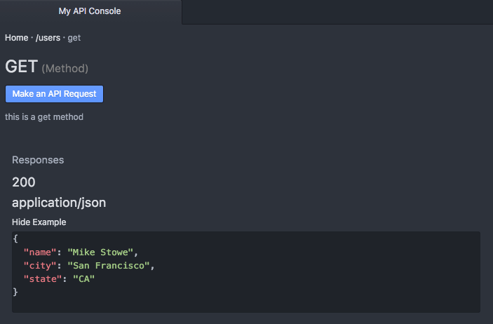

This allows us to ensure consistency not only in how our resources operate, but also in our documentation.  Making it easy for our developers to go from resource to resource, knowing that the code and the documentation will be consistent.

### Traits

Traits operate in a fairly similar fashion to resourceTypes except that they operate more as functions with the placeholder values being sent as properties in an array, and are designed specifically for use within the method (such as GET, PUT, PATCH, POST, or DELETE).

Traits are typically used for operations such as pagination, searching, or filtering the method data.

To delcare a trait, first we need to declare it at the top of our spec under the `traits` property:

```yaml
#%RAML 1.0
title: My API
baseUri: http://api.mydomain.com
version: 1

traits:
  pageable:
    queryParameters:
      offset:
        description: Skip over a number of elements by specifying an offset value for the query
        type: integer
          required: false
          example: 20
          default: 0
      limit:
        description: Limit the number of elements on the response
        type: integer
        required: false
        example: 80
        default: 10
```

And then we will pull it into our method using the `is` property:

```yaml
/users:
  get:
    is: [pageable]
```

Once the trait is successfully pulled in, we can see it within the API designer or in our documentation:

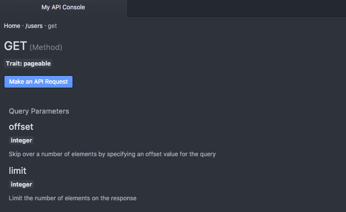

As mentioned, you can also take advantage of placeholders with traits by sending these values back in a key, value based array:

```yaml
#%RAML 1.0
title: My API
baseUri: http://api.mydomain.com
version: 1

traits:
  filterable:
  pageable:
    queryParameters:
      offset:
        description: Skip over a number of elements by specifying an offset value for the query
        type: integer
        required: false
        example: 20
        default: <<offsetDefault>>
      limit:
        description: Limit the number of elements on the response
        type: integer
        required: false
        example: 80
        default: <<limitDefault>>
/users:
  get:
    is: [
      filterable,
      pageable: {offsetDefault: 0, limitDefault: 20}
    ]
```

The biggest advantage of traits is that they ensure consistency in the way your methods are acted upon.  Remember in Chapter 1 where we talked about how easy it is for these inconsitencies to crop up, making APIs difficult to use (as you have to search one resource one way, but another a completely different way - or worse, the same resource different ways) - by using traits you are creating a sure way NOT to run into this issue and have such inconsistences across your API.

The other nice thing about traits is that you can apply mulitple traits to your methods, letting you pull in and utilize multiple types of functions as much or as little as needed.

### Libraries

As you start adding traits, resourceTypes, schemas, and examples, it's easy for your specifcation to become bloated.  Of course you can call all of these in with `!include` but you still are not able to take advantage of code reuse at scale.

One of the new features of RAML 1.0 is libraries, or the ability to call in parts of your specification in a namespaced scope - meaning that you can pick and choose which of these items to apply to your spec.

This is particularly helpful if you have multiple APIs that share common themes (`/users` for example).

To pull in a namespaced library, you'll first want to create a library file.  We declare that a RAML specification is only to be used as a library by adding "Library" to the top of the file, like so:

```yaml
#%RAML 1.0 Library
```

By adding this line, we are telling the RAML spec to treat this file as a class, and not as an independent RAML specification.

Let's move our resourceTypes and Traits into this file:

```yaml
#%RAML 1.0 Library

resourceTypes:
  collection:
    get:
      # Get method goes here
    post:
      # Post method goes here
    delete:
      # Delete method goes here

traits:
  filterable:
    # Filterable trait goes here
  pageable:
    # Pageable trait goes here
```

Now to call in this library, we will again pull it in using the `uses` property:

```yaml
#%RAML 1.0
title: My API
baseUri: http://api.mydomain.com
version: 1

uses:
  users: libraries/users.raml

/users:
    get:
```

However, at this point nothing is being applied to the resource or the method.  If we try to apply the "collection" resourceType as we did before, the result will be an error:

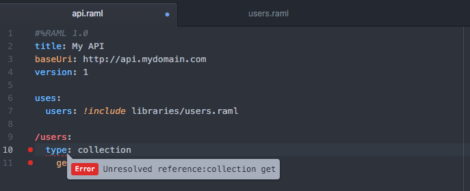

The reason for this is that the resourceType "collection" doesn't exist!  Instead, it is under the `users` namespace that we declared above, and as such to utilize that resourceType we have to call it with respect to its parent's name, like so:

```yaml
#%RAML 1.0
title: My API
baseUri: http://api.mydomain.com
version: 1

uses:
	users: libraries/users.raml

/users:
  type: users.collection
  get:
```

As you can see, now the resourceType `users.collection` has been applied to our resource:

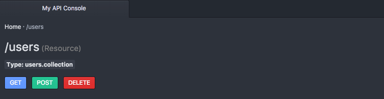

By having your resourceTypes, traits, schemas, and examples namespaced, you are able to prevent collisions and only use the components of a library that you choose - keeping your specification clean, and your code reusable.

## Going Further

Hopefully this tutorial has helped you master the RAML specification, but there are many more resources and much more you can do with the RESTful API Modeling Language.  There are also more advanced features for code reusability and extensibility (such as Data Types, Annotations, and Overlays) as well as numerous mechanisms to describe your API's security schemes.

Be sure to visit the official RAML website for more on these features, as well as additional resources, and a list of over 100 open source projects designed to make designing, building, testing,documenting, and sharing your API easier.

### Have Questions?

Check out the @RAMLAPI twitter handle, or post your questions in the RAML.org forums.
